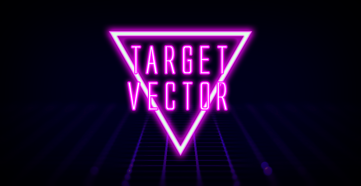

# Target Vector
An Unreal Engine 5 Template utilizing EOS (Epic Online Services), Steam, Modular Gameplay, Common UI, Advanced Locomotion System Refactored XT, Lyra Modeling Tools and more. _This is currently a work in progress, and not production-ready_

**Features**

- The EOSGameInstance C++ class exposes basic EOS functionality such as Login, Friends, Invites, and Creating and Joining Sessions to Blueprint. EOSPlus allows for a secondary authentication system (Steam by default).
- Modular Gameplay ready with UIExtension to improve Mod/UGC Authoring workflows in actors and UIs.
- CommonUI based main menu system with Tabbed navigation, Input Routing, Loading Screen, Primary Layout and Async Mixin implementation (Push Widget).
- Server Browser (via helper functions (work in progress)). 
- Advanced Locomotion System Refactored: Expanded Character States, Improved Foot Print system, Sliding and Vaulting (XT) _Coming Soon_.
- Modeling Tools: The Lyra Procedural Level block out tools using Geometry Script adapted into a plugin.
- TTToolbox: Various editor tools to facilitate retargeting characters and animations to the ALS skeleton.
- SkeletalMeshMerger: Merge skeletal component at run-time.

**Dependecies**

- OnlineSubsystemEOS
- OnlineServicesEOS
- OnlineSubsystemSteam
- Geometry Script

**Included Additional Plugins**

- AsyncMixin
- Common UI
- Common Gameplay
- Common User
- Game Features
- Modular Gameplay
- UIExtension
- TTToolbox
- SkeletalMeshMerger

## Basic Setup
This project is configured to read EOS Artifacts from EOSSettings.ini, which for securirity purposes, requires you to create it, and is set up to be ignored in the .gitignore file.

In the Config folder create a text file named EOSSettings.ini and copy and paste the following:

	[/Script/OnlineSubsystemEOS.EOSSettings] 
	+Artifacts=(ArtifactName="EOSArtifact",ClientId="",ClientSecret="",ProductId="",SandboxId="",DeploymentId="",EncryptionKey="")

Complete the required Artifacts fields in the ini file. These values can be found in Application Details in your Epic Dev Portal.
It is highly recommended to keep your Artifacts in this ini file instead of editing the values in the Editor.

Open the Project with the Editor and in Project Settings > Maps & Modes select the EOS_GameInstance class in the Game Instance Class drop-down menu.

### Code
Source code for the EOS Game Instance class can be found in the Source folder inside the Project folder. You are encouraged to expand, improve or sub-class the EOSGameInstance C++ class to meet the unique requirements of your project.

CommonUI functionality is implemented in the B_PlayerController, B_MainMenuController and B_HUD Classes.
Source code for ALS_Refactored_XT can be found in the Plugins folder inside the Project folder.

### Testing
To test the basic EOS functionality use the EOS_Testing.bat file. Edit the "ue5path" varible to reflect your Unreal Engine 5 installation directory. Currently, to test EOS functionality between multiple players you will need an Epic and Steam login for each player. 

- Developer Authentication Tool integration coming soon.- 
- Automated Testing and CI coming soon.

### Troubleshooting
When testing, the Epic Games Overlay and Steams Overlay should always appear. If not, check your log files and verify all the EOS Artefacts are correct. Incorrect or incomplete EOS setup may also result in crashes.

### CI/TDD Advanced Setup

**EVERYTHING BELOW HERE IS IN THE PROCESS OF BEING INTEGRATED AND DOES NOT CURRENTLY WORK**

**Requirements**

- Unreal Engine 5 built from github source code
- git
- github
- Jenkins
- OpenCppCoverage

### Initial Tests

Inside the repository, there're some tests to simulate accelerating a pawn and simulating key presses!!!

This are inside the Tests folder of the project.

These tests use a void map to simulate everything needed.

Look into the commits to have a grasp of how the order is important to TDD (test first, implementation after test).

I think they'll be really useful and save you a lot of headaches, enjoy!!

### Introduction

Unreal Engine provides a testing suite inside it's Automation Framework, but it's tedious to write a test, build the project, open the editor, run the tests and see if they pass or fail.

There's a way to do the tests more efficiently (you still have to create a class from within the editor to use it as a test class so the project 'sees' it), without having to wait the editor to finish and check the results for yourself.

What you need is Jenkins, an automation program that triggers a pipeline execution via an event. A pipeline is a configuration of a workspace environment, a series of stages, each of them consisting of a series of steps (calling batch files in windows, executing commands, printing logs, etc), and finally things that you do after (post) the pipeline is executed.

Inside that pipeline we're going to declare how to build the project, run our tests, check if they fail or pass and also which parts of the project aren't being tested (via code coverage).

**How's the process then?**

1) You code locally (create tests, classes, etc).
2) You commit code.
3) You push your code (or do a pull request).
4) Github receives the push and uses it's webhook to notify Jenkins via a tunnel created by ngrok (because we don't have a way to communicate directly with Jenkins).
5) Jenkins receives a notification that a repository included in a pipeline has received a push.
6) Jenkins pulls every change to the repository in Jenkins workspace.
7) Jenkins starts the pipeline associated with that repository.
8) The Pipeline builds the project.
9) The Pipeline runs the tests while doing code coverage.
10) The Pipeline shows build status and tests reports.
11) Jenkins notifies Github the results of the pipeline build.

Looks easy, right? The only problem is understanding that Jenkins is meant to be used in a server, which means that it (and every application that the pipeline invokes) has to work in headless mode. Also, no application invoked has to have any input allowed.

This problem is a source of headaches in the beginning, but you'll become accustomed to it.

### First Time Steps

0) Install required programs.
1) Create Unreal Project.
2) Add .gitignore.
3) Add Jenkinsfile and push changes.
4) Create a class (without parent, None) from the UE Editor, place it in a separate 'Tests' folder and use it as a test class.
5) Create tests.
6) In Jenkins Install:
      - Blue Ocean plugin (there're plugins necessary with it and if you want a prettier Jenkins).
      - GitHub plugin (for pull requests).
      - HTTP request plugin (mm don't know if necessary, but it was some time ago).
      - Cobertura plugin (for code coverage).
      - Slack plugin and configure it (if you want slack notifications).
7) Create Jenkins Multibranch Pipeline project.
8) Create a tunnel via ngrok to the Jenkins port (default is 8080).
9) Add a webhook to the github repository referencing the http given by ngrok (**don't forget to add a forward slash '/' to the webhook trail if it doesn't have one!!!**).
10) Push to see the build trigger in Jenkins.

It would be nice to add github checks to pull requests, but it's not possible with a free account (in private repositories).

### **Jenkinsfile**

- I use node 'master' because I have only one pc for Jenkins.
- I use a custom workspace (and at the beginning of the disk) because the Unreal Build Tool has problems with long filenames.
- The environment variables are used as parameters, to avoid hardcoding.
- BuildWithoutCooking.bat it's used to build the project. I don't use cooking because I think that process should be made in continuous delivery.
- It's not necessary to create the Visual Studio files because we don't do anything with Visual Studio, we run the tests using the Unreal Automation Tool.
- TestRunnerAndCodeCoverage uses OpenCppCodeCoverage (which does the code coverage) attached to the Unreal Engine Editor (which does the tests run).
- TestRunnerAndCodeCoverage.bat assumes that you have a separate folder for tests (\Tests). This could be changed hardcoding it or adding another parameter to the batch file.
- The Tests Report is made in JSon so we need to parse it to XML to be readable by JUnit. So, thanks to Michael Delva for his test report parser method found in his [blogspot](https://www.emidee.net/ue4/2018/11/13/UE4-Unit-Tests-in-Jenkins.html), I modified it only a little.
- The CodeCoverageReport will be used by Cobertura to display the code coverage.
- In some places, slackSend is used to send messages to a Slack Workspace. The channel name is only used if you want to override the one used in the Slack plugin configuration.
- I do a git hard reset and git clean to clean the workspace after everything has been done. This way, if the repository it's something big, only the changes are downloaded and thus, we save bandwidth.
